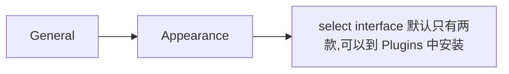
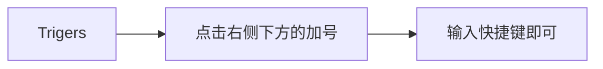
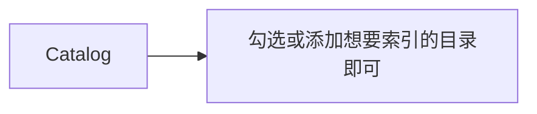

# app lanucher | Quicksilver
<!-- MarkdownTOC -->

- [Quicksilver](#quicksilver)
- [主题](#%E4%B8%BB%E9%A2%98)
- [应用快捷键](#%E5%BA%94%E7%94%A8%E5%BF%AB%E6%8D%B7%E9%94%AE)
- [索引](#%E7%B4%A2%E5%BC%95)
- [Plugins](#plugins)

<!-- /MarkdownTOC -->

## Quicksilver
> Quicksilver 开源且免费; 个人认为比 Spotlight 和 alfred 好用[下载地址](https://github.com/quicksilver/Quicksilver)

## 主题
> Quicksilver 不仅支持自定义主题颜色,透明度等.还支持大概 10 种主题

更换主题方法:

## 应用快捷键
> 支持 finder 等任何程序 `alt+key` 形式的快捷键

## 索引
> Quicksilver 的索引支持符号链接,可以选择任意文件夹作为索引目录  
> alfred和spolight用的是同一个索引引擎,不得不说很垃圾.

## Plugins
> 插件,勾选安装即可
